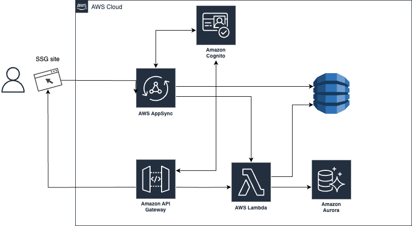

# Overview

Fully serverless web architecture on AWS with Prisma and GraphQL.

CDK version 2 and Amplify are used for deployment and development.

Please read this article for more information.

1. [Prisma](https://www.prisma.io/)
2. [Prisma with AWS AppSync](https://github.com/maoosi/prisma-appsync)
3. [Export Amplify backends to CDK and use with existing deployment pipelines](https://aws.amazon.com/jp/blogs/mobile/export-amplify-backends-to-cdk-and-use-with-existing-deployment-pipelines/)
4. [Setup authorization rules](https://docs.amplify.aws/cli-legacy/graphql-transformer/auth/)

## Features

This template provides GraphQL using AWS serveless services.

- AppSync and API gateway support

- DynamoDB and RDS support

- Prisma support for schema management

- Cognito authentication support

Infra/Backen/Frontend code is written by typescript, and deploy and debelop by AWS CDK and Amplify.

## Tech Stack

- [x] Prisma

Prisma is a performant open-source GraphQL ORM-like layer doing the heavy lifting in your GraphQL server.

[Prisma](https://www.prisma.io/)


- [x] Prisma Appsync

Prisma AppSync is a library that makes it easy to implement GraphQL servers with Prisma.

[Prisma with AWS AppSync](https://github.com/maoosi/prisma-appsync)

- [x] GraphQL

GraphQL is a query language for your API, and a server-side runtime for executing queries by using a type system you define for your data.

- [x] AWS AppSync

AWS AppSync is a managed GraphQL service that makes it easy to develop, secure, and scale GraphQL APIs.

# Architecture



## Access Flow

1. Appsync -> Lambda -> RDS

2. Appsync -> DynamoDB

3. Appsync -> Lambda -> RDS and DynamoDB

## Directory Structure

```bash
```

# Getting Started

## Local Enviroment

1. Install dependencies

```bash
cd backend
npm install
```

2. Run docker

```bash
docker-compose up -d
```

2. Generate prisma client

```bash
yarn generate # for generate prisma client, create GraphQL client to prisma/generate
npx prisma migrate dev --name init # for create migration file, create sql and migrate it to DB to prisma/migration
cp prisma/generated/migration/[target_date]/migration.sql prisma/migration.sql # for migration target sql
```

3. Test by jest(Prisma Unit Test)

```bash
npx jest -- user-controller.test.ts
```

4. Test by GraphQL Playground

```bash
yarn run dev
```

## Deploy to AWS

1. Install dependencies

```bash
cd backend
npm install
```

2. Deploy to AWS

```bash
# edit cdk.json, change app "name" and "schema" to your name
# please update amplify/api/backend/cli-inputs.json and paramers.json of api name
amplify export --out ./cdk/lib/
cdk deploy --all -c env=[Name]
```

3. Create schema

```bash
aws lambda list-functions | grep "migration" # Please check function-name you deployed to AWS which include "migration"
aws lambda invoke --function-name <function-name> output.json 
```

4. Insert data to DynamoDB/RDS via GraphQL API

Please open Appsync and run GraphQL on the editor.


x. Delete all resources

```bash
yarn cdk destroy --all -c env={EnvName}
```

# Customize

## Apprync -> Lambda -> RDS

1. Edit prisma/schema.prisma

2. Generate prisma client

```bash
yarn generate
yarn codegen
# rm -rf prisma/migrations
npx prisma migrate dev --name init
```

3. Copy prisma/migrations/[target_date]/migration.sql to prisma/migration.sql

4. Test and Deploy to AWS

## Appsync -> DynamoDB

1. Edit amplify/api/backend/schema.graphql

2. Generate typescript 

```bash
# Change accessibility: @auth(rules: [{ allow: public }, { allow: groups, groups: ["user"] }])
amplify export --out ./cdk/lib/
```

# Frontend

1. Install dependencies

```bash
cd frontend
npm install
```

2. Setting amplify

Please update src/aws-exports.js to your own Cognito Information

```bash
amplify init
amplify add codegen --apiId [your graphql api id]
# Please update src/aws-exports.js to your own Cognito Information
# const awsmobile = {
#    "aws_project_region": "", // Your region
#    "aws_cognito_identity_pool_id": "", // Cognito Identity Pool ID
#    "aws_cognito_region": "",  // Your region
#    "aws_user_pools_id": "", // Cognito User Pool ID
#    "aws_user_pools_web_client_id": ""  // Cognito User Pool ID
# };
```

- [x] Update schema

```bash
amplify codegen
```

## Prerequisites

- [Node.js](https://nodejs.org/en/download/) (v10.0.0 or higher)

- [AWS CLI](https://docs.aws.amazon.com/cli/latest/userguide/cli-chap-install.html) (v1.16.0 or higher)

- [Docker](https://docs.docker.com/get-docker/) (v19.03.0 or higher)


## Installation

# Reference
1. [Prisma](https://www.prisma.io/)
2. [Prisma with AWS AppSync](https://github.com/maoosi/prisma-appsync)
3. [Amplifyで構築したバックエンドをCDKで出力して既存のデプロイパイプラインで使用する新機能「エクスポート」のご紹介]https://aws.amazon.com/jp/blogs/news/export-amplify-backends-to-cdk-and-use-with-existing-deployment-pipelines/